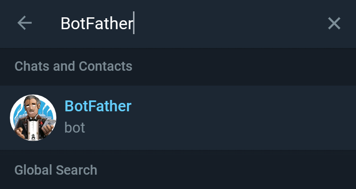
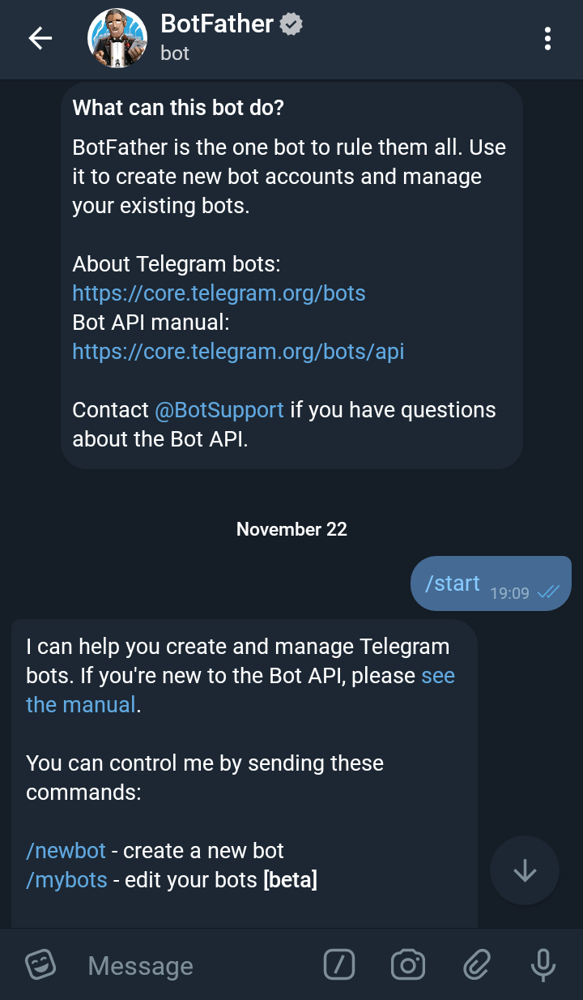
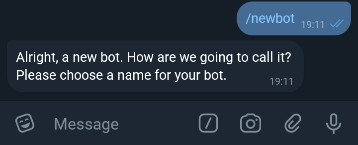
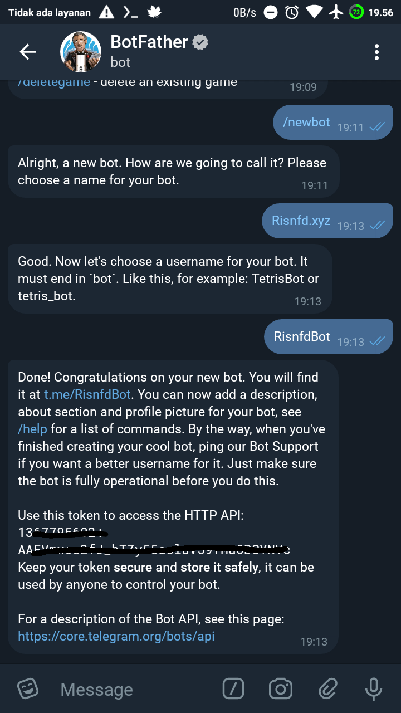
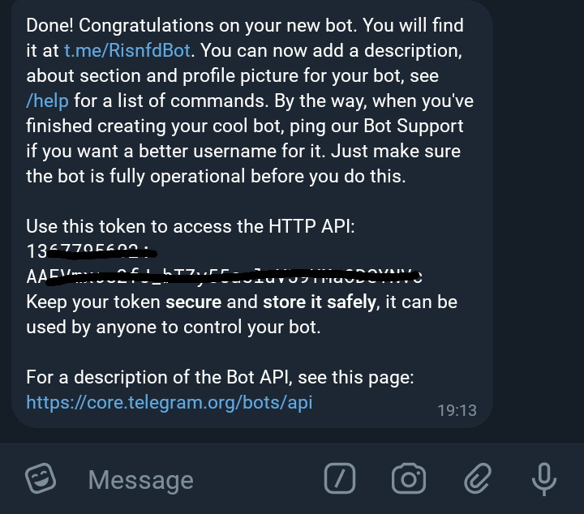
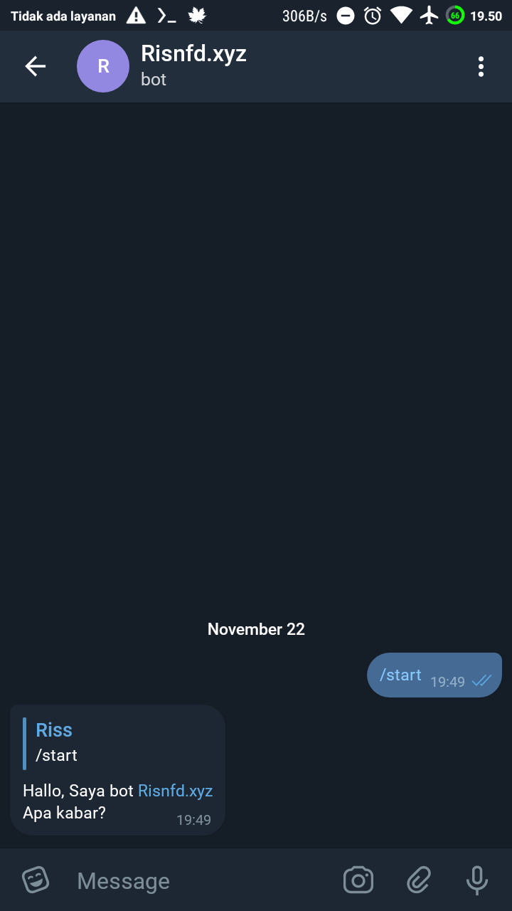

Telegram bot adalah sebuah bot atau robot yang diprogram dengan berbagai perintah untuk menjalankan serangkaian instruksi yang diberikan oleh pengguna. Bot ini hanyalah sebuah akun Telegram yang dioperasikan oleh perangkat lunak yang memiliki fitur AI.

Ada dua cara untuk membuat bot telegram, yaitu:
1. Membuat bot dengan memprogram Bot dari nol sampai jadi 100% (dengan coding)
2. Membuat bot dengan mengaitkan Bot dengan bot penyedia layanan lain (tanpa coding)

Biasanya orang-orang yang menekuni profesinya sebagai bot developer akan memilih nomor 1, Kenapa? Karena membuat bot dengan coding akan lebih mudah untuk mengkustom botnya. Tidak seperti bot dengan coding, Bot yang menggunakan bot penyedia layanan seperti halnya ManyBot akan lebih sulit untuk di kustomisasi dan memiliki watermark.

Sebelum saya melanjutkan tutorialnya, ada beberapa yang harus disiapkan, diantaranya:
* Token Bot yang masih baru
* API bot telegram (saya menggunakan pyTelegramBotApi) untuk mengenal API nya anda dapat mengunjungi halaman github eternnoir [disini](https://github.com/eternnoir/pyTelegramBotAPI)

Berikut adalah tutorial lengkapnya:

### Pembuatan Bot

Hal yang pertama kali kita lakukan adalah mengambil Token Bot, berikut caranya:

#### Membuat Token Bot Telegram

Simak cara berikut.

1. Masuk ke aplikasi telegram kalian masing-masing lalu inputkan BotFather di pencarian, berikut contohnya


2. Lalu klik Start dan botFather, dan tampilan akan seperti berikut:


3. Setelah botFather aktif, kalian dapat mengirim pesan perintah `/newbot` untuk membuat bot baru, tampilannya akan seperti berikut:


4. Kirim nama Bot Kalian dan setelah itu Kirim Username Botnya, seperti berikut


5. Jika berhasil Maka Token Bot akan Terlihat, seperti berikut


Catat Token yang sudah di dapat agar tidak lupa, dan kalian bisa lanjut ke cara berikutnya

#### Memasang API Bot

Pada bagian ini, kalian harus memiliki Terminal (Command Line Interface).

Berikut cara pemasangannya.

1. Install python versi terbaru yaitu Python 3.9, jika kalian memiliki versi yang lebih baru, gunakan saja versi yang kalian miliki. Untuk menginstallnya, kalian cukup menyalin perintah berikut <br>
```bash
sudo apt update && sudo apt upgrade && sudo apt install python3 python3-pip
```

2. Jika sudah selesai, kalian bisa lanjut memasang API bot nya dengan mengetikkan perintah berikut <br>
```bash
sudo pip3 install pyTelegramBotAPI
```

Hanya dua cara untuk menginstall API bot nya, maka sekarang kalian dapat membuat program pertama botnya.

#### Membuat Program Bot Telegram

Untuk membuat programnya kalian bisa menggunakan Text Editor kesukaan kalian.

Berikut caranya

1. Buat file bernama `main.py`. Lalu buka dengan teks editor

2. Import API tadi dengan menggunakan code berikut <br>
```python
import telebot
```

3. Membuat variable untuk memasukkan Token Bot yang tadi di buat dengan code berikut <br>
```python
bot = telebot.TeleBot("TOKEN BOT KALIAN", parse_mode=None) # Pada bagian parse_mode kalian bisa menggantinya dengan HTMl atau Markdown
```

4. Membuat jawaban perintah yang di kirim oleh pengguna, jadi misalnya pengguna mengirim pesan `/help` atau `/start` kepada bot, bot tersebut akan membalasnya secara otomatis dengan teks. Berikut code nya <br>
```python
@bot.message_handler(commands=['start', 'help'])
def kirim_pesan(message):
  bot.reply_to(message, "Hallo, Saya bot Risnfd.xyz<br>nApa kabar?")
```

5. Untuk membuatnya bekerja, kita cukup tambahkan code berikut <br>
```python
bot.polling()
```

6. Maka program akan terlihat seperti ini <br>
```python
import telebot
bot = telebot.TeleBot("TOKEN BOT KALIAN", parse_mode=None)
@bot.message_handler(commands=['start', 'help'])
def kirim_pesan(message):
  bot.reply_to(message, "Hallo, Saya bot Risnfd.xyz\nApa kabar?")
bot.polling()
```

7. Coba jalankan file tersebut dengan `python3 main.py` dan jika berhasil, bot akan membalas pesan anda seperti berikut


Jika sudah berhasil membuat bot seperti itu, kalian dapat mengubahnya sesuai keinginan kalian.

Agar bot dapat berjalan 24jam tanpa error, kalian bisa mengunakan hosting/VPS, namun akan di bahas pada artikel selanjutnya.
